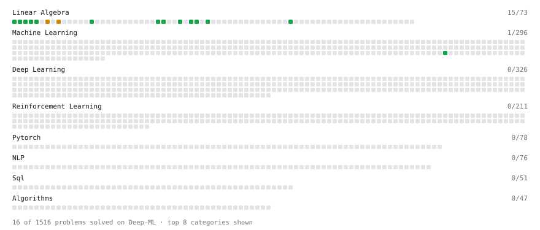

# Deep-ML

My machine learning practice from [Deep-ML](https://www.deep-ml.com). Every solution here was written by hand.

**12** solved · 9 problems · 0 labs · 3 math

[**Browse the interactive portfolio**](https://muhib360.github.io/deep-ml/) to replay this filling in over time.

## Problems

| | Difficulty | Solved | |
| --- | --- | --- | --- |
| [Calculate Cosine Similarity Between Vectors](https://www.deep-ml.com/problems/76) | easy | 2026-10-05 | [solution](problems/0076-calculate-cosine-similarity-between-vectors) |
| [Compute the Cross Product of Two 3D Vectors](https://www.deep-ml.com/problems/118) | easy | 2026-10-05 | [solution](problems/0118-compute-the-cross-product-of-two-3d-vectors) |
| [Dot Product Calculator](https://www.deep-ml.com/problems/83) | easy | 2026-10-05 | [solution](problems/0083-dot-product-calculator) |
| [L2 Normalization Along an Axis](https://www.deep-ml.com/problems/1022) | easy | 2026-10-07 | [solution](problems/1022-l2-normalization-along-an-axis) |
| [Pairwise Cosine Similarity Matrix](https://www.deep-ml.com/problems/1072) | easy | 2026-10-08 | [solution](problems/1072-pairwise-cosine-similarity-matrix) |
| [Reshape Matrix](https://www.deep-ml.com/problems/3) | easy | 2026-10-08 | [solution](problems/0003-reshape-matrix) |
| [Transpose of a Matrix](https://www.deep-ml.com/problems/2) | easy | 2026-10-08 | [solution](problems/0002-transpose-of-a-matrix) |
| [Vector Element-wise Sum](https://www.deep-ml.com/problems/121) | easy | 2026-10-05 | [solution](problems/0121-vector-element-wise-sum) |
| [Vector Norms (L1/L2/L-inf) and the Frobenius Norm](https://www.deep-ml.com/problems/328) | easy | 2026-10-06 | [solution](problems/0328-vector-norms-l1-l2-l-inf-and-the-frobenius-norm) |

## Math

| | Difficulty | Solved | |
| --- | --- | --- | --- |
| [Vector Operations](https://www.deep-ml.com/math-problems/7) | easy | 2026-10-05 | [solution](math/0007-vector-operations) |
| [Matrix Multiplication](https://www.deep-ml.com/math-problems/10) | medium | 2026-10-08 | [solution](math/0010-matrix-multiplication) |
| [Vector Norms and Linear Independence](https://www.deep-ml.com/math-problems/8) | medium | 2026-10-05 | [solution](math/0008-vector-norms-and-linear-independence) |

---

_This file is regenerated by Deep-ML on every push._
